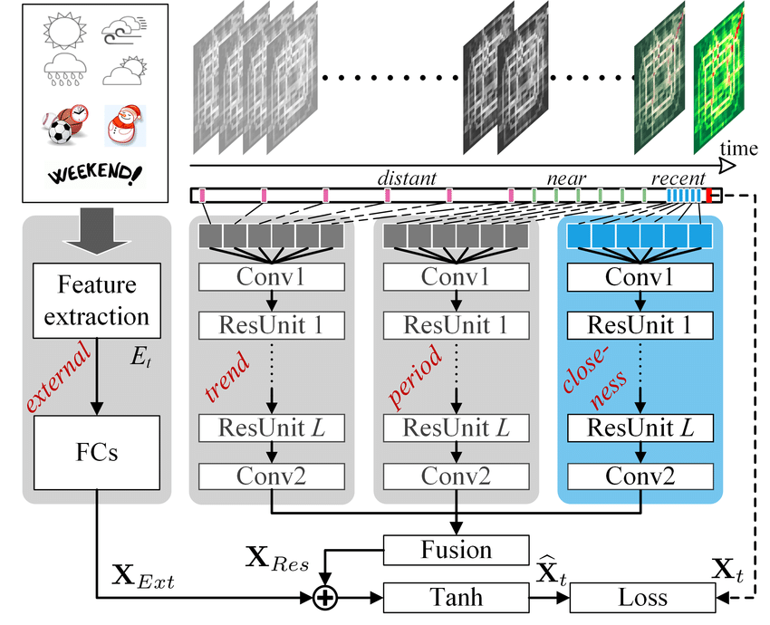

# New York City Bycicle Flow Prediction #

### Author: Angelo Antonio Manzatto ###

### Problem ###

Forecasting the input flow and output flow of bycicle traffic on areas of New York City during a timeframe in order to help on public safety.

### Model ###

This problem makes use of a Spatial Temporal Network called ST-ResNet that uses Residual Units to concatenate the feature spaces.

------------------------------

### This work was based on the following article and the credits go to their authors ###

Title: Deep Spatio-Temporal Residual Networks for Citywide Crowd Flows Prediction
Authors: Zhang, Junbo and Zheng, Yu and Qi, Dekang
Book Title: Proceedings of the Thirty-First AAAI Conference on Artificial Intelligence (AAAI-17), 
Pages:1655-1661
Year:2017

------------------------------

The dataset can be download checking the information on the following link:
https://github.com/lucktroy/DeepST/tree/master/data/BikeNYC